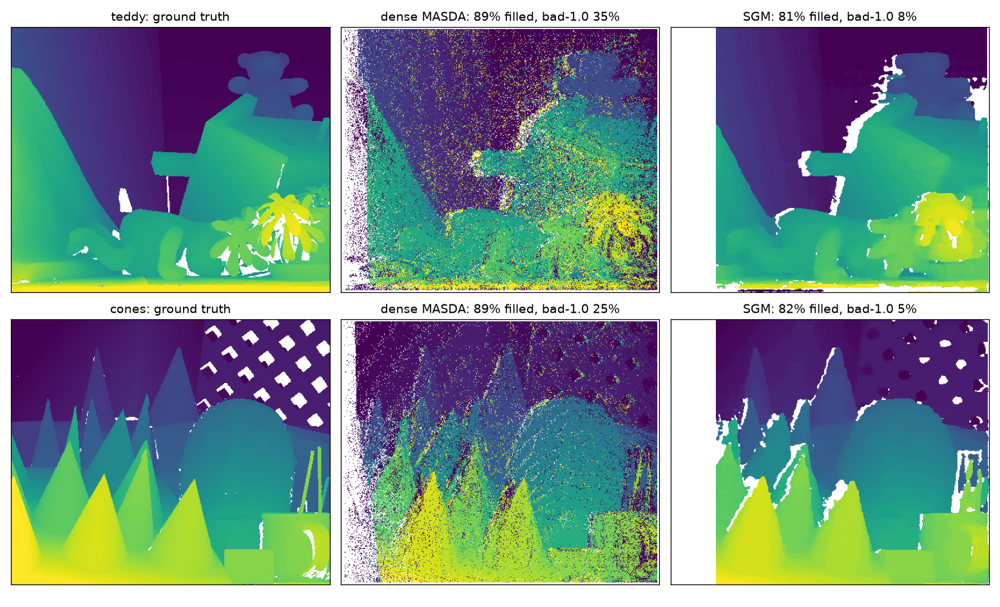

# MASDA — the matcher

The point of the project. Max-sum loopy belief propagation for bipartite data
association with mutual exclusivity, plus clutter and misdetection terms, used as
the matcher for sparse stereo correspondence.

```sh
cd core && make && make test              # 32 preprocessing + 22 matcher assertions
./build/de_match ../bags/full_on
```

## Messages

From the plan, with the misdetection and clutter options folded into the maxima
since "leave `i` unmatched" and "`j` is clutter" are competing explanations:

```
rho_ij  = s(i,j) - max( gamma,  max_{k != j} beta_ik )
beta_ij = s(i,j) - max( lambda, max_{k != i} rho_kj  )
```

Both maxima exclude one element, so each iteration is two **top-2 reductions** —
one over rows, one over columns — rather than a quadratic scan. That is what makes
the plan's ~10⁵–10⁶ ops per frame estimate achievable.

`s(i,j)` is a stand-in for a calibrated log-likelihood ratio: descriptor agreement
scaled so Hamming = bits/2 (chance) scores 0 and a perfect match scores +1, minus a
quadratic y-residual penalty. That puts `gamma = 0` at the interpretable place of
"no better than chance". Calibrating this properly is an open question in the plan,
and remains one.

## The decision rule, and a mistake worth recording

Two questions that an earlier version of this conflated:

| Question | Answered by |
|---|---|
| **Which** candidate? | the belief, `beta + rho - s`. It measures an edge's advantage over its competitors, so it is the right *ordering* — but its **sign is not a decision**. |
| Match **at all**? | `s(i,j)` against `gamma`. That is what gamma means. |

Gating acceptance on `belief > 0` returned **zero matches** on exactly-tied
problems whose optimum matched everything: when no candidate has an advantage,
every belief is ≤ 0. That is the plan's cited condition for BP's guarantee lapsing
— a non-unique LP optimum (Bayati, Shah & Sharma) — and it is not a corner case
here, because projected dots make descriptors ~3.3× degenerate.

The rule is therefore: order by belief, decide by gamma, require mutual agreement
between row and column, then **greedily complete** in belief order over what
remains. The completion pass is necessary rather than cosmetic — under near-ties
every row's best belief points at the same column, so mutual agreement commits
exactly one pair. Each greedily accepted edge has `s > gamma` and two free
endpoints, so it strictly raises the objective. Adding it also improved agreement
with brute force, from 56/60 exact optima to **58/60**.

## Validated against brute force

Message passing that merely converges proves nothing; the question is whether it
converges to the assignment that maximises the objective. On 60 random problems
small enough to enumerate exhaustively:

| | |
|---|---|
| valid one-to-one matchings | **60 / 60** |
| exact optimum reached | **58 / 60** |
| total objective vs optimal | **0.998** |

## Results on real stereo pairs

848×480, FAST keypoints, 7×7 Census, same candidate graph for both methods.

| | matches | objective | median \|dy\| | median disparity | time |
|---|---|---|---|---|---|
| **emitter ON** (projected dots) | | | | | |
| MASDA | **615** | **410.9** | 0.359 px | 37.9 px | 1.67 ms |
| mutual-NN + ratio test | 421 | 288.7 | 0.326 px | 36.8 px | 0.36 ms |
| *MASDA advantage* | ***+46.3%*** | ***+42.3%*** | | | |
| **emitter OFF** | | | | | |
| MASDA | **206** | **115.2** | 0.423 px | 20.0 px | 0.43 ms |
| mutual-NN + ratio test | 183 | 106.6 | 0.404 px | 19.9 px | 0.12 ms |
| *MASDA advantage* | ***+13.0%*** | ***+8.1%*** | | | |

**The advantage scales with ambiguity, which is the plan's entire argument.**
+46% with the projector on, +13% with it off. MASDA is worth its cost precisely
where descriptors are degenerate, and only modestly worth it where they are not.

**Median |dy| = 0.359 px** is independent corroboration that the matches are real:
a wrong match has no reason to land on the same image row, and this is the plan's
free rectification-health metric. Note MASDA's |dy| is *slightly worse* than
nearest-neighbour's — expected, since it accepts ~46% more and the additional ones
are the harder cases.

**MASDA is not the bottleneck, as the plan predicted** -- but the margin is
narrower than this table first suggested, because the table was measured on the
desktop.

The timings above are desktop timings. `de_match` had never been built on the
Jetson at all: `tools/deploy.sh` synced only `jetson/`, and the `core/build`
directory that was sitting on the Jetson held x86-64 objects copied from the
desktop. The first native build there was 2026-08-07. Measured on the same
`full_on` bag:

| | desktop | Jetson (MAXN, 6 cores) |
|---|---|---|
| MASDA | 1.38 ms | **5.04 ms** |
| mutual-NN + ratio | 0.34 ms | 0.82 ms |
| matches / objective | 615 / 410.9 | 620 / 412.7 |

So the correct statement is 5.04 ms against a 33.3 ms budget, which is 15%, not
5%. Still not the bottleneck against 26 ms of preprocessing, but a 3.7x factor
that should not have been reported as if the two numbers came from the same
machine. The match counts and objectives agree across the two (615 vs 620), so
this is the same work on slower cores rather than a different problem.

## Score margin, exported per match

Every `Match` now carries `margin`: best-minus-second-best s(i,j) over that left
keypoint's candidates, measured against lambda where there is no runner-up. It is
close to free -- one pass over the edge list -- and it is the most useful
confidence available. Over eight Middlebury scenes with ground truth, precision by
margin quartile runs 0.169 / 0.286 / 0.391 / 0.659.

On `full_on` the margin immediately explains what MASDA is doing:

| | matches | median margin | margin < 0.2 |
|---|---|---|---|
| MASDA | 620 | 0.388 | **31.5%** |
| mutual-NN + ratio | 422 | 0.535 | 14.3% |

MASDA accepts 47% more matches, and the extra ones are concentrated in the
low-margin band -- which is exactly what a ratio test exists to remove. Neither
number is better on its own; the point is that the consumer can now see which
matches are the doubtful ones and weight or drop them, rather than receiving 620
matches with no way to tell them apart.

## lambda and gamma were transposed

`MatchConfig::lambda` and `MatchConfig::gamma` were named the wrong way round
relative to the article's convention: lambda is clutter, the cost of leaving a
LEFT (measurement) keypoint unmatched, and gamma is misdetection, the cost of
leaving a RIGHT (object) keypoint unmatched. The code used one field consistently
for the left side throughout, so the mathematics was self-consistent and no
measured result was ever wrong -- but only because every experiment so far has
been run with lambda == gamma. They stop being interchangeable the moment they
are set apart, which is what stereo wants: a left keypoint occluded in the right
view is a different rate from a right keypoint the detector never proposed.

`test_lambda_gamma_are_distinct` in `core/tests/test_match.cpp` is the regression
guard. Its first version compared two match counts that were both zero, which
passed without testing anything; it now asserts the exact counts (1 and 0).

## Convergence: the messages oscillate, the decision does not

| iterations | matches | objective | oscillating iterations | time |
|---|---|---|---|---|
| 20 | 617.5 | 408.71 | 0 | 1.44 ms |
| 50 | 618.0 | 409.12 | 2 | 2.42 ms |
| 100 | 618.0 | 409.29 | 8 | 4.16 ms |
| 200 | 618.0 | 409.29 | 32 | 8.15 ms |

It **never formally converges** — the largest message change stays above 1e-4 at
every budget — yet the answer is stable to four significant figures from 50
iterations, and to within 0.1% at 20. Meanwhile the count of iterations where the
change *grew* rises steadily, so a subset of messages genuinely oscillates.

This is the plan's warning showing up early, before any loopy pairwise factors
exist to justify it. It is currently **benign**: oscillation is confined to
messages that do not change the decision. Worth re-checking the moment smoothness
factors are added, which is when the plan expects the guarantee to break properly
and damping to need raising past 0.5.

**20 iterations is the operating point.** More costs time and buys 0.1%.

## Coarse-to-fine: built, measured, and **not** worth it here

The plan calls this the biggest single lever, for two compounding reasons: cutting
candidates per keypoint from ~100–200 down to 8–16, and removing the false
candidates from repetitive structure that create near-ties. It is implemented as
the plan specifies — a **soft** prior, never hard pruning, since hard pruning at
the coarse level is how thin structures get lost.

The prior is self-widening in the way the plan asks for, and that part works: each
cell's sigma is the MAD of the coarse disparities landing in it, so a cell
straddling a depth discontinuity automatically gets a wide, weak prior. Measured
in the tests: sigma goes from 2.0 px on a clean surface to **83 px** across a
discontinuity, and a cell with too few coarse matches imposes no prior at all.

**But it makes the result worse on real data** (emitter on, `bags/full_on`):

| configuration | k | matches | objective |
|---|---|---|---|
| single level | 2.7 | **615.2** | **410.9** |
| coarse-to-fine 1/8 | 2.7 | 609.5 | 405.5 |
| coarse-to-fine 1/4 | 2.7 | 509.0 | 325.3 |
| coarse-to-fine 1/4, `w_prior` 0.25 | 2.7 | 537.5 | — |

Lowering the prior's weight recovers some of the loss but never beats single level.

### Why the premise does not hold here

**k is already 2.7, not 100–200.** The plan's motivation assumed a wide search, but
this pair is rectified, so a ±2 px epipolar band plus a disparity range already
does the restricting a coarse pass was meant to do.

Better evidence than that arithmetic: deliberately widening the search does not
change the answer at all.

| max_dy / max_candidates | k | matches |
|---|---|---|
| 2 / 24 | 2.7 | 615.2 |
| 6 / 64 | 7.2 | **615.2** |
| 12 / 128 | 13.8 | **615.2** |

Inflating k by 5× leaves the result *identical*, because the y-residual term in
`s(i,j)` already scores those extra candidates below gamma. **There are no false
candidates left for a disparity prior to remove.** So the prior can only contribute
its own error — coarse Census on downsampled projected dots is much less
distinctive, and coarse disparity quantises to ±0.5 px, which is ±2–4 px once
scaled up.

Prior coverage also shows the mechanism: only **1%** of cells at 1/8, because the
106×60 coarse image yields too few keypoints to reach three matches per cell. At
1/4 coverage rises to 29% and the damage rises with it — the prior is active more
often, and being active is what hurts.

### When it would matter

Kept in the code, off by default, because the premise could return:

- **Unrectified or drifted calibration**, where the epipolar band must widen and k
  genuinely grows.
- **Much higher keypoint density**, where per-row candidates multiply.
- **Temporal matching** between consecutive frames, which the plan wants for
  ego-motion. There the search is 2-D and unconstrained by rectification, so k
  really is large and a prior — from IMU-derived rotation compensation — should pay.

This is the plan's own instruction followed: measure before deriving. The measurement
says don't.

## The cheap smoothness experiment: also does not help

The plan's instruction was to run plain MASDA, fit a robust disparity surface over
a neighbourhood graph, re-score `s(i,j)` against it, re-match, two or three passes
— because that captures most of the smoothness benefit inside the existing
closed-form updates and "reveals whether the full derivation is worth it".

Implemented: a robust local plane fit `d = ax + by + c` per keypoint over its 10
nearest matched neighbours, by IRLS with Tukey weights so a depth discontinuity in
the neighbourhood drops out rather than dragging the plane between two surfaces.
(A k-nearest-neighbour graph rather than the Delaunay triangulation the plan names
— a proxy, and worth revisiting if this line is ever resumed.)

**Iterating makes it monotonically worse.** With `w_smooth = 1`:

| pass | matches | base objective | median \|dy\| | prior coverage |
|---|---|---|---|---|
| 1 | **615.2** | **410.85** | 0.364 | — |
| 2 | 402.5 | 284.75 | 0.355 | 100% |
| 3 | 297.0 | 210.72 | 0.363 | 100% |
| 4 | 233.2 | 161.47 | 0.375 | 100% |

And it is not a weight-tuning problem. Sweeping `w_smooth` down two decades, pass 3
against the 615.2 / 410.85 / 0.364 baseline:

| `w_smooth` | matches | base objective | median \|dy\| |
|---|---|---|---|
| 0.02 | 602.8 | 403.73 | 0.368 |
| 0.05 | 594.5 | 398.58 | 0.373 |
| 0.10 | 569.0 | 385.50 | 0.372 |
| 0.25 | 506.5 | 344.55 | 0.382 |

Monotonic in every column, with no optimum at any positive weight. **The best value
of `w_smooth` is 0.**

Note the objective is scored *without* the smoothness term, which is the only
honest comparison — adding a term to an objective and then reporting the objective
rose would measure nothing.

### Why, probably

The most likely reason is the same one that sank coarse-to-fine, and it is
structural rather than a tuning failure: **the prior is fitted from the very
matches it then judges.** Where the matches are already right it can only pull them
off; where they are wrong the fit is wrong in the same way, so it reinforces the
error instead of correcting it. A smoothness prior derived from the current
solution is close to self-confirming.

## The limitation both experiments expose

**Neither result is conclusive in the way that matters, because there is no ground
truth.** The available measures are match count, objective, and median |dy|, and
none of them can distinguish "removed 100 wrong matches" from "removed 100 right
ones". Median |dy| barely moved across every configuration tried, so it is not
sensitive enough to arbitrate.

So the honest reading is narrower than "smoothness does not help": *at this
operating point, on this one static scene, with no way to check correctness, both
priors reduce match count and neither improves the only independent quality metric
available.* That is a reason to stop adding priors, not proof that the information
they encode is worthless.

**The blocker for further algorithmic work is bring-up step 4** — the laser
rangefinder against walls at 1, 2 and 3 m. Until disparities can be checked against
a known distance, additions to `s(i,j)` cannot be evaluated, only observed. The
plan puts step 4 before driving for exactly this reason; it turns out to gate the
matcher's development too.

## What is not done
- **Fixing the timing comparison.** The coarse-to-fine path times detection plus
  matching, while the single-level MASDA figure times matching only. The two
  numbers are not comparable and the conclusion above rests on match counts and
  objective rather than on timing.
- **Calibrating gamma and lambda.** Currently hand-set. The plan's candidate is a
  small MLP over descriptor distance, y-residual, coarse-disparity residual and
  response ratio.
- **The full smoothness factor derivation.** The cheap version was the plan's test
  of whether this is worth doing, and it came back negative — but see the ground
  truth caveat above before treating that as settled. Eigen 3.4 is on the desktop
  and 3.3.4 on the Jetson if it is resumed; the current 3x3 fit needs neither.
- **Sub-pixel disparity refinement**, which the plan notes depth accuracy hinges on.
- **Ground-truth validation** against a laser rangefinder — bring-up step 4. Until
  then, median |dy| and the objective are the only quality measures, and neither
  proves the disparities are *correct*, only that they are consistent.

## Detector repeatability: over-propose on the right, then gate on margin

Repeatability, not the matcher, is the ceiling. Pooled over eight Middlebury
scenes only 44.6% of left keypoints have any right keypoint within 1 px of their
true correspondence. Shi-Tomasi picks its maxima independently per image, and a
maximum in one view is often not a maximum in the other. No matcher can recover a
correspondence that was never proposed.

Over-proposing on the right lifts it, with diminishing returns past 2x:

| right density | repeatability | right kp | edges | correct | precision |
|---|---|---|---|---|---|
| baseline | 44.6% | 5688 | 13873 | 1796 | 0.616 |
| 2x | 52.5% | 10305 | 20873 | **2057** | 0.573 |
| 3x | 53.8% | 14245 | 24192 | 2089 | 0.555 |
| 4x | 54.0% | 17497 | 26057 | 2091 | 0.541 |

+261 correct matches at 2x, which is +14.5%, for 1.5x the edges and 1.27x the
time. Precision falls though, 0.616 to 0.573, because the extra right keypoints
are also extra distractors.

That is where the exported margin pays for itself. Gating the 2x run on margin
recovers the precision and keeps most of the gain:

| | correct | precision |
|---|---|---|
| baseline, no gate | 1796 | 0.616 |
| 2x, margin >= 0.05 | 1989 | 0.610 |
| **2x, margin >= 0.10** | **1957** | **0.632** |

At a margin threshold of 0.10 the over-proposed run is better on *both* axes than
the baseline: +161 correct matches and +0.016 precision. The whole
precision/recall curve moves outward rather than trading along it, which is
visible at matched precision anywhere on it:

| precision | baseline correct | 2x + margin gate correct |
|---|---|---|
| ~0.705 | 1644 (gate 0.20) | 1782 (gate 0.25) |
| ~0.785 | 1471 (gate 0.40) | 1506 (gate 0.45) |

Recommended configuration: 2x right-image density, margin gate at 0.10, left
detector unchanged. Both are now `de_match` flags, `--right-density` and
`--min-margin`.

The gate is applied AFTER matching, not before. Dropping low-margin candidates
before the solver would remove the competition that gives the surviving margins
their meaning; the gate is a decision about what to hand the consumer.

### Measured on the Jetson, not extrapolated

I estimated 6.4 ms from the Python edge-count ratio of 1.27x. Measured on
`full_on`, 120 pairs, MAXN:

| config | matches | median \|dy\| | margin < 0.2 | Jetson time |
|---|---|---|---|---|
| baseline | 620.1 | 0.365 px | 31.5% | 5.14 ms |
| 2x right + margin 0.10 | 603.8 | 0.364 px | 22.2% | **8.84 ms** |

The real factor is 1.72x, not 1.27x, so the cost is 8.84 ms: 27% of the frame
budget rather than a fifth. The estimate was wrong because the C++ detector is
`detect_keypoints_fast` at cell 32, and doubling per_cell there does not add
candidate edges in the same proportion as the Python sweep's cell-12 dense
Shi-Tomasi. Extrapolating a Jetson cost from a desktop ratio is the same mistake
as the 1.67 ms figure, one step removed.

### What is NOT yet verified

`full_on` has no ground truth, so the accuracy claim does not transfer to it. What
the numbers above show is the gate working mechanically: the low-margin share
falls from 31.5% to 22.2%, and median |dy| is unchanged at 0.364 px. Fewer
doubtful matches is not the same statement as more correct ones.

The +161 correct / +0.016 precision result is validated on Middlebury, in Python,
with a dense Shi-Tomasi detector at cell 12. The C++ path uses FAST candidates
with Shi-Tomasi scoring at cell 32. Those are different detectors in a different
density regime, so the transfer is plausible and unproven.

### Closed: the C++ matcher, measured against ground truth

`core/tools/de_bench.cpp` runs the C++ matcher and the C++ detector on the
Middlebury scenes, with the same evaluation rules as the Python side (unknown
ground truth excluded from precision rather than scored wrong; matchable requires
the partner to have been detected). `article/export_middlebury.py` writes the
pairs as raw Y8 plus a float32 disparity map, since core/ has no image decoder and
should not gain one for a benchmark.

Eight scenes, `--sweep`:

| right/cell | margin gate | matches | correct | precision | recall | ms/scene |
|---|---|---|---|---|---|---|
| 3 (baseline) | 0.00 | 2026 | 1402 | 0.706 | 0.937 | 0.38 |
| 3 | 0.10 | 1816 | 1323 | 0.743 | 0.884 | 0.38 |
| 6 | 0.00 | 2585 | **1706** | 0.673 | 0.899 | 0.58 |
| **6** | **0.10** | 2251 | **1585** | **0.718** | 0.836 | 0.62 |
| 9 | 0.00 | 2743 | 1772 | 0.659 | 0.882 | 0.83 |
| 9 | 0.10 | 2338 | 1622 | 0.708 | 0.807 | 0.80 |
| 12 | 0.10 | 2382 | 1615 | 0.693 | 0.791 | 0.95 |

**The recommendation holds on the C++ path.** Over-proposing at 2x lifts correct
matches by 21.7% (1402 to 1706), and adding the 0.10 margin gate lands at 1585
correct with precision 0.718 -- better than the baseline on *both* axes, +183
correct and +0.012 precision. At matched precision the curve is outside the
baseline's too: baseline gives 1250 correct at 0.762, and 2x with a 0.30 gate
gives 1375 at the same 0.762.

The gain is larger here than in Python (+13.1% against +9%), which is consistent
with the C++ detector proposing far fewer right keypoints to begin with (3607
across the eight scenes against Python's 5688) and so having more headroom.

Note the different regime rather than assuming the numbers are interchangeable:
recall reads much higher here (0.937 against 0.716) because `matchable` is
relative to what the detector proposed, and FAST at cell 32 proposes a smaller,
easier set. The two experiments agree on the *direction and rough size* of the
effect, which is what was in question.

So `--right-density 6 --min-margin 0.10` is now justified by a ground-truth
measurement of the code that actually ships. What it costs on the Jetson at
848x480 is the 8.84 ms above, 27% of the frame budget.

### One thing that did not work

Making misdetection cheaper, so the surplus right keypoints are discarded more
readily, does nothing. Sweeping gamma from -0.1 to 0.0 at every density moves
correct matches by at most 5 out of ~2000, which is noise.

The reasoning was that over-proposing means many right keypoints legitimately go
unmatched, so leaving one unmatched ought to be cheap. It was the first intended
use of lambda and gamma being separable at all. But a surplus right keypoint is
usually nobody's best candidate, so it goes unmatched whatever gamma says: gamma
only bites when a right keypoint is genuinely contested, and the extra ones mostly
are not. The lambda/gamma fix was still worth making, since the naming was wrong
and the fields are not interchangeable, but this particular payoff is not there.

## Sub-pixel disparity

Disparity was the difference of two independently refined keypoint positions.
Both are sub-pixel, but their errors are uncorrelated, and nothing in the
subtraction ever looked at how well the two windows line up. `refine_disparity`
fits a parabola to the SAD cost between the windows at d-1, d, d+1 and takes its
vertex: three window evaluations per match, run after matching, so the message
passing is untouched. The vertex offset is clamped to +-0.5 px, because a parabola
through three samples of a non-parabolic cost can put its vertex anywhere once the
curvature approaches zero, and that is how sub-pixel refinement quietly makes
disparity worse.

Measured on the eight Middlebury scenes, at the recommended configuration:

| refinement | correct | precision | median inlier error | within 0.5 px |
|---|---|---|---|---|
| off | 1585 | 0.718 | 0.196 px | 87.3% |
| **on** | **1601** | **0.725** | **0.167 px** | **94.5%** |

Median inlier error falls 14%, and the share of correct matches localised inside
half a pixel goes from 87.3% to 94.5% -- the tail outside half a pixel more than
halves, 12.7% to 5.5%. Correct matches and precision also rise slightly, since a
few matches sitting just outside the 1 px threshold move inside it.

Jetson agrees: 1583 -> 1599 correct, 0.196 -> 0.167 px, 87.2% -> 94.5%, and the
refinement does not show up in the timing.

One correction to how I framed this beforehand. I said median disparity error was
0.50 px and that this was pure integer-versus-quarter-pixel quantisation. That was
true of the *Python* experiment, whose detector returns integer positions. The C++
detector already has `subpixel = true`, so its error was 0.196 px before any of
this, and the headroom was a third of what I claimed. The gain is real but it is
in the tail, not the median.

## The frame budget does not close at 30 Hz

Measured end to end on the Jetson at MAXN, 848x480, `full_on`, 120 pairs:

| stage | ms per stereo pair | share of 33.3 ms |
|---|---|---|
| preprocessing, L and R concurrent (`--parallel`) | 26.54 | 79.6% |
| MASDA, baseline config | 5.14 | 15.4% |
| **total, baseline** | **31.68** | **95.1%** |
| MASDA, `--right-density 6 --min-margin 0.10` | 8.84 | 26.5% |
| **total, recommended config** | **35.38** | **106.2%** |

So the accuracy work does not fit at 30 Hz. The recommended configuration is over
budget, and the baseline leaves 1.6 ms of headroom on the mean while the worst
observed preprocessing pair alone is 33.2 ms, which is the whole budget before a
single message is passed.

Two things this settles.

**The matcher is not the problem and optimising it further is not the answer.**
Detection is 20.98 ms of the 21.24 ms per frame; Census is 0.25 ms. Even reducing
MASDA to zero leaves preprocessing at 80% of the budget. The `_seg_max_excluding`
port that was on the backlog would have been busywork twice over: the C++ already
does an O(1) `max excluding one element` through `Top2`, since that trick is a
NumPy workaround for something a plain loop does naturally, and the matcher is not
where the time goes.

**The choice is a real engineering trade, not a tuning question.** Options, in the
order I would try them:

1. Run the matcher at a lower rate than the camera. Correspondence at 15 Hz with a
   66.7 ms budget is comfortable (53% with the recommended config) and for
   odometry on an indoor vehicle 15 Hz is likely adequate. This costs nothing but
   latency.
2. Attack detection, which is 63% of the budget on its own. FAST already replaced
   the dense Shi-Tomasi scan; the remaining candidates are the Shi-Tomasi scoring
   of FAST corners and the NMS. Neither has been profiled at that level.
3. Drop resolution. 640x480 is 75% of the pixels of 848x480 and preprocessing is
   close to pixel-bound.

What should not happen is quietly shipping the recommended configuration and
discovering the frame drops on the vehicle. It is off by default and the flags are
opt-in.

## Where the 21 ms goes, and what the two levers actually buy

`de_profile` times the three detector stages and sweeps resolution. Jetson, MAXN,
`full_on`, 40 frames, medians, per image for the detector stages:

| resolution | kp/img | FAST cand | stage 1 FAST | stage 2 NMS | stage 3 refine | census | match | pair | %budget |
|---|---|---|---|---|---|---|---|---|---|
| 848x480 | 1075 | 22200 | 11.34 | 4.93 | 4.28 | 0.22 | 5.11 | 25.89 | 77.7% |
| 424x240 | 278 | 6946 | 3.36 | 1.46 | 1.95 | 0.05 | 0.98 | 7.81 | 23.4% |
| 282x160 | 118 | 2638 | 1.39 | 0.51 | 0.58 | 0.02 | 0.34 | 2.85 | 8.6% |

Stage 1 is 55% of detection, not the overwhelming majority I assumed from "it
touches every pixel while the rest is sparse". NMS and refinement are 45% between
them, because FAST nominates 22200 candidates per image to produce 1075 keypoints:
95% of them are discarded only after both sparse stages have paid for them.

Throughput is 26-31 Mpx/s across the three resolutions, so preprocessing is
essentially pixel-bound and resolution scales as expected.

### The FAST threshold is the better lever

Nobody had tried it. The threshold of 8 was chosen against the DENSE detector, on
the grounds that it keeps 96% of its keypoints at 1.45x the speed. That is a
quality comparison, not a budget one.

Jetson preprocessing, concurrent, 40 pairs:

| fast_threshold | keypoints/img | preprocessing ms/pair | %budget |
|---|---|---|---|
| 8 (current) | 1074 | 26.75 | 80.3% |
| **12** | 947 | **18.84** | **56.5%** |
| 16 | 761 | 14.58 | 43.7% |
| 20 | 611 | 11.39 | 34.2% |
| 30 | 375 | 7.91 | 23.7% |

And against ground truth, at the recommended matcher configuration, raising it
costs correct matches roughly in proportion while leaving quality alone:

| fast_threshold | correct | precision | median inlier err | within 0.5 px |
|---|---|---|---|---|
| 8 | 1601 | 0.725 | 0.167 px | 94.5% |
| 12 | 1441 | 0.724 | 0.167 px | 94.7% |
| 16 | 1344 | 0.725 | 0.167 px | 94.2% |
| 20 | 1211 | 0.717 | 0.167 px | 94.0% |
| 30 | 932 | 0.721 | 0.167 px | 95.5% |

Precision is flat to within 0.008 and sub-pixel accuracy does not move at all.
The threshold buys time by discarding keypoints, not by discarding *good* ones,
and there is no cliff anywhere in the range.

### Threshold beats resolution, clearly

Normalising both levers against what they cost:

| change | time saved | cost |
|---|---|---|
| fast_threshold 8 -> 12 | 30% | 10% of correct matches |
| fast_threshold 8 -> 20 | 57% | 24% of correct matches |
| 848x480 -> 424x240 | 70% | 74% of keypoints |

Raising the threshold is a much better trade at every point, and it has a second
advantage the table does not show: median inlier disparity error stays at 0.167 px
across the whole threshold sweep, whereas halving resolution halves the pixels a
disparity is measured in and so costs depth precision directly.

So resolution is the lever of last resort, not the second option. Recommendation:
`fast_threshold = 12`, which puts preprocessing at 56.5% of budget and should
leave the recommended matcher configuration fitting inside 30 Hz.

### Measured: the whole stack fits at 30 Hz

`de_profile --fast-threshold 12 --right-density 6 --min-margin 0.10`, which is
every improvement switched on including sub-pixel refinement, Jetson, 40 pairs:

| resolution | kp/img | FAST | NMS | refine | census | match | pair | %budget |
|---|---|---|---|---|---|---|---|---|
| **848x480** | 1307 | 8.30 | 3.74 | 2.92 | 0.25 | 7.86 | **23.07** | **69.3%** |
| 424x240 | 339 | 2.48 | 0.82 | 1.31 | 0.06 | 1.46 | 6.13 | 18.4% |

23.07 ms against 33.3 ms, so about 10 ms of headroom, with more keypoints per
image than the 848x480 baseline had (1307 against 1075, because the right image is
over-proposing). My arithmetic guess was ~27 ms; measured is 23.07. Third estimate
in this document, third time the measurement differed -- but at least this one
differed in the useful direction.

So: `fast_threshold 12`, `--right-density 6`, `--min-margin 0.10`, sub-pixel on.
That is the configuration to run, and it now has a measured budget and a
ground-truth accuracy number behind every part of it.

## The disparity gate was the biggest quality problem, and it was untuned

`MatchConfig` defaults to `min_disparity 1.0, max_disparity 220.0`. With
f·B = 21.48 px·m that is a search range of **0.10 m to 21.5 m**. Every measurement
on my own IR bags used it, and in a room it admits several times more depth than
exists.

The cost is not just outliers. Extra candidates per keypoint are extra competition,
so the score margin falls, and the margin is what predicts precision. Measured live
on the same scene, 10 fps, ~78 frames each:

| | gate [1, 220] px = 0.10-21.5 m | gate [3.6, 53.7] px = 0.40-6.0 m |
|---|---|---|
| points per frame | 553 | **646** |
| Z median | 0.58 m | 0.82 m |
| Z p1 / p99 | 0.10 m / 5.74 m | 0.42 m / 4.49 m |
| median margin | 0.388 | **0.657** |
| margin < 0.2 | 31.5% | **11%** |

So tightening the gate gives *more* matches, at nearly double the median margin,
with a third as many doubtful ones, and a depth distribution that looks like a room
instead of like noise. On the wide gate a quarter of all points came out nearer than
0.19 m, piled against the limit, which is what a wrong match at a gate boundary
looks like.

This also qualifies an earlier number in this document. The 31.5% of matches below
margin 0.2 reported for `full_on` was measured through the wide gate; with a
plausible gate it is 11%. The Middlebury results are unaffected, since those set a
per-scene range of 60 or 80 px, which is already tight.

`de_pipe` takes `--min-disparity`/`--max-disparity` and prints the implied depth
range in its banner, so a wrong gate is visible rather than silent.
`desktop/de_live_ros2.py` takes `--min-range`/`--max-range` **in metres** and
defaults to 0.4-6.0 m, because that is the unit the scene is in.

## A dense baseline, and an uncomfortable number

`article/dense_baseline.py` runs OpenCV's semi-global matcher on the same eight
Middlebury scenes. It exists to answer "can we produce a dense depth image" with a
picture, and to make the sparse-versus-dense argument quantitative rather than
rhetorical. SGM is the family the D4 ASIC belongs to, so this is also the closest
proxy to the ASIC available offline.

Setting the comparison up fairly needs care, because the two answer different
questions. Dense SGM is scored the Middlebury way — the fraction of known-GT pixels
whose error exceeds 1 px, over the whole image. MASDA is scored at its own matched
keypoints, a much smaller denominator. So SGM is **also** scored at exactly MASDA's
keypoints, which is the only like-for-like number here.

| scene | SGM coverage | SGM bad-1.0 | at MASDA's keypoints: SGM | MASDA |
|---|---|---|---|---|
| teddy | 81.1% | 8.1% | 0.899 | 0.615 |
| cones | 81.7% | 5.5% | 0.943 | 0.781 |
| Art | 70.3% | 14.5% | 0.810 | 0.489 |
| Books | 80.7% | 9.7% | 0.935 | 0.704 |
| Dolls | 79.9% | 9.3% | 0.898 | 0.689 |
| Laundry | 77.6% | 17.7% | 0.491 | 0.301 |
| Moebius | 78.1% | 11.5% | 0.925 | 0.680 |
| Reindeer | 74.9% | 11.1% | 0.935 | 0.592 |
| **pooled** | **78.0%** | **10.9%** | **0.858** | **0.616** |

**Dense SGM is more accurate than MASDA at MASDA's own keypoints, 0.858 against
0.616, and it fills 78% of the image as well, in 17 ms.** That is not a small gap
and it should not be written around.

### What it does and does not mean

It is not "SGM beats MASDA" as a statement about inference. SGM aggregates matching
cost along eight paths through the image, which is a **smoothness prior over the
whole disparity field**. MASDA uses uniqueness and nothing else. So what this
measures is the value of the prior MASDA does not have, and the answer is: a great
deal. 0.616 to 0.858 on identical points and identical data.

That is the same conclusion [09](09-matching.md) and the article's section 10
already reached from the other direction — smoothness is the largest piece of
information the matcher currently ignores — but as an argument rather than a
number. The number is 24 points of precision.

Three things keep it from being the whole story:

- The two constraints are **orthogonal, not competing**. Uniqueness is a statement
  about the matching being one-to-one; smoothness is a statement about the surface.
  SGM has no uniqueness constraint at all, which is why it needs a left-right
  consistency check bolted on afterwards to reach 78% coverage rather than 100%.
  The interesting object is a matcher with both, which is what a smoothness factor
  in the factor graph would be.
- The earlier smoothness attempt failed for a specific and fixable reason. A
  two-pass prior fitted from the matches it then judges is self-confirming; SGM's
  path aggregation is a joint optimisation over the whole field, which is a
  different thing entirely.
- SGM declines 22% of known-GT pixels. MASDA declines by only ever proposing at
  keypoints. Neither number is coverage in the same sense.

### What this changes

The honest reading is that the current matcher is not competitive with a
well-implemented dense method on accuracy, and the gap is explained by a missing
prior rather than by anything about max-sum. That makes the smoothness factor the
highest-value piece of work on the matcher, ahead of everything currently in
section 0.5 of the TODO, and it makes `dense_baseline.py` the thing to measure it
against.

### Can this reach SGM? Measured from both ends: not as it stands

Two experiments, each cheap, and together they close the question without writing a
smoothness factor first.

**1. How many of MASDA's errors could any better inference fix?** For every wrong
match, ask whether the correct right keypoint was in that left keypoint's candidate
list at all. Pooled over the eight scenes, 2916 scorable matches:

| | share |
|---|---|
| correct | 61.6% |
| wrong, but the correct answer **was** a candidate | 8.1% |
| wrong, and the correct answer was **never offered** | 30.3% |

So a perfect re-ranking of the existing candidates — a smoothness factor that never
makes a mistake — tops out at **0.697**. SGM is at 0.858. The prior cannot close the
gap, because in 30% of cases the answer is not in the room.

Proposing more right keypoints does not rescue this. Sweeping the right detector
from 555 to 2994 keypoints per scene raises the fixable share (0.081 to 0.148) and
lowers the correct share by more (0.616 to 0.531), leaving the ceiling flat at
0.68-0.70 throughout. The correct correspondence frequently is not at *any* detected
keypoint; it is between them.

**2. So give it every pixel.** A semi-dense variant lets each left keypoint match
any right pixel on its row within the disparity range — 71 candidates per keypoint
instead of 5, so the correct answer is essentially always available. Uniqueness is
kept.

| variant | candidates/kp | precision | solver |
|---|---|---|---|
| keypoint-to-keypoint | 5 | 0.616 | 7 ms |
| **semi-dense, keypoint-to-pixel** | **71** | **0.587** | **68 ms** |
| dense SGM | every pixel | 0.858 | 17 ms |

**That 0.587 is a precision, and reading it alone was a mistake.** The two rows have
different denominators: semi-dense matched 5486 scorable keypoints against 2916, so
it produced **3221 correct matches against 1796 — 79% more**. I first wrote this up
as "it gets worse", which is the precision-versus-count trap this document warns
about elsewhere, committed here.

**And with the margin gate it is better on both axes at once.** With 71 candidates
instead of 5 the margin becomes far more informative — a candidate that clearly
beats 70 others is almost certainly right, where beating 4 others means little:

| margin gate | matches | correct | precision |
|---|---|---|---|
| keypoint-to-keypoint baseline | 2916 | 1796 | 0.616 |
| semi-dense, no gate | 5486 | 3221 | 0.587 |
| **semi-dense, gate 0.05** | 2956 | **2255** | **0.763** |
| semi-dense, gate 0.10 | 2058 | 1728 | 0.840 |
| semi-dense, gate 0.15 | 1465 | 1292 | **0.882** |

At gate 0.05 that is **+459 correct matches and +0.147 precision** over the sparse
baseline. At gate 0.10 it reaches 0.840, and at 0.15 it reaches 0.882 — **past SGM's
0.858** at the cost of fewer points.

### What the two together say

**Yes, it reaches SGM — on precision, and without a smoothness factor.** Semi-dense
candidates plus the margin gate gives 0.840 at gate 0.10 and 0.882 at 0.15, against
SGM's 0.858. Uniqueness and Census are enough, provided the correct answer is
actually offered *and* the confidence measure is used to discard the cases where the
descriptor could not decide.

That is a better result than the one this section originally reached, and it was
hidden by two mistakes of mine in the same afternoon. First, comparing precisions
across different denominators and concluding semi-dense was worse when it produced
79% more correct matches. Second, evaluating it ungated, when the whole point of the
margin is that it becomes *more* informative as candidates multiply: winning against
70 rivals means something that winning against 4 does not.

Two honest qualifications:

- The comparison is not perfectly like-for-like. SGM's 0.858 is measured at MASDA's
  2916 keypoints; the gated semi-dense numbers are over its own surviving matches,
  which is a smaller and self-selected set. Matching SGM's precision on fewer points
  is a real result, but it is not the same statement as beating it everywhere.
- It stays sparse. SGM still fills 78% of the image, and no gating of keypoint
  matches produces a depth map.

**The cost is the real obstacle.** The semi-dense solver is 68 ms per 450x375 scene,
three times the Jetson's whole frame budget at a fifth of the pixels. So this is not
the 30 Hz on-vehicle matcher as written — but it is now a quality ceiling worth
optimising towards, rather than a direction excluded on principle. The candidate set
is 71 per keypoint of which the gate discards most; generating fewer, better
candidates is an obvious avenue and has not been tried.

## MASDA as a dense matcher: it works, and it shows exactly what uniqueness cannot do

`article/dense_masda.py` runs MASDA over every pixel rather than over keypoints.
That is possible without changing the solver because the problem decomposes:
correspondences lie on one image row, so rows share no left or right index, and the
whole image is a single assignment problem whose exclusivity constraints happen to
couple only within rows. 9.15M edges on a 450x375 pair with 60 disparities.

| | coverage | bad-1.0 teddy | bad-1.0 cones | runtime |
|---|---|---|---|---|
| dense MASDA | **89.0%** | 34.7% | 24.6% | 21 s (NumPy) |
| SGM | 81.1% | **8.1%** | **5.5%** | 24 ms (C++ SIMD) |



It produces a real depth image, and with *more* coverage than SGM. The scene
structure is plainly there: the bear, the cones, the plant. It is also covered in
salt-and-pepper speckle, because every pixel decides independently and uniqueness
constrains only that two left pixels may not claim the same right pixel. Nothing
says a pixel should agree with its neighbour.

The margin gate trades coverage for accuracy, and on this problem the trade is bad:

| gate | coverage | bad-1.0 |
|---|---|---|
| 0.00 | 89.0% | 34.7% |
| 0.10 | 34.8% | 15.9% |
| 0.20 | 16.7% | 9.4% |
| 0.30 | 4.9% | **7.4%** |

Matching SGM's error rate costs everything: 4.9% of pixels against SGM's 81.1%.

### The unifying result

Put beside the keypoint experiments, this explains all of them at once.

- At **keypoints** — which are by construction the places with enough texture to
  localise — semi-dense candidates plus the margin gate reach 0.882 precision
  against SGM's 0.858.
- At **every pixel**, including the textureless majority, the same method reaches
  34.7% bad against SGM's 8.1%.

Uniqueness is sufficient where the descriptor has something to say, and cannot
substitute for smoothness where it does not. SGM's path aggregation propagates
disparity from textured regions into textureless ones; a per-pixel descriptor
comparison has no mechanism for that, however the candidates are arranged.

Which is the argument for the sparse formulation, arrived at from the opposite
direction: keypoints are not a computational shortcut, they are a *selection of the
pixels where this class of matcher has information*. Running it everywhere else
mostly manufactures speckle.

### On the runtime column

21 s against 24 ms is a factor of ~900, and it is not an algorithmic comparison.
MASDA here is NumPy with `np.maximum.at` scatter-reductions over 9.15M edges; SGM is
compiled C++ with SIMD and decades of optimisation. The C++ MASDA on a sparse
problem is already ~200x faster than the NumPy one, so the honest statement is that
the constant is large and unmeasured, not that the algorithm is 900x slower.

What *is* algorithmic: 9.15M edges for a 168k-pixel image is 54 candidates per
pixel, and the margin gate then discards most of what was scored. Coarse-to-fine or
a previous-frame prior would cut that, and neither has been tried.

### Coarse-to-fine: 5.3x faster, and it damages the confidence measure

The obvious way to cut 54 candidates per pixel is to bracket the answer with a
coarse pass. Half resolution, inpaint the holes, upsample, then search ±4 px around
that guess at full resolution:

| | edges | runtime | coverage | bad-1.0 |
|---|---|---|---|---|
| flat dense | 9,154,890 | 21 s | 89.0% | 34.7% |
| coarse-to-fine | 1,448,007 | **4.0 s** | 85.4% | 33.0% |

**5.3x faster for a slightly better ungated error rate.** As a speed change it works
exactly as intended.

The problem appears once the margin gate is applied. Compared at similar coverage,
coarse-to-fine is worse:

| | coverage | bad-1.0 |
|---|---|---|
| flat dense, gate 0.20 | 16.7% | **9.4%** |
| coarse-to-fine, gate 0.20 | 29.1% | 19.0% |
| flat dense, gate 0.10 | 34.8% | **15.9%** |
| coarse-to-fine, gate 0.10 | 48.7% | 23.6% |

The mechanism is worth naming because it is not obvious. When the coarse pass is
wrong, the ±4 px window **excludes the correct answer entirely**. The fine pass then
runs a competition among candidates that are all wrong, and one of them wins it
convincingly — so the margin comes out *high* on a wrong match. Coarse-to-fine does
not merely propagate coarse errors, it launders them into confident ones.

That makes it strictly a speed/quality trade rather than a free win, and it damages
the one signal this matcher has that SGM does not. It also independently reproduces
the earlier coarse-to-fine negative result from the article, by a different route
and with the mechanism identified.

If the speedup is wanted, the fix is to keep a few candidates *outside* the bracket
so the margin still measures a real competition — untested.

## Dense MASDA in C++: 105x the NumPy version

`core/tools/de_dense.cpp`. The NumPy dense matcher spends almost all of its 21 s in
scatter — `np.maximum.at` over a 9.15M-entry edge list, an indirection per element —
and the structure does not need an edge list at all.

On a regular disparity grid, indexing scores as `s[(y*W + x)*D + d]` makes both
max-sum reductions constant-stride walks:

- **rho** ("max over this left pixel's other disparities") is a contiguous run of D.
- **beta** ("max over this right pixel's other claimants") walks
  `(xr+dmin)*D + k*(D+1)` — stride D+1.

No edge list, no indirection. Rows share no left or right pixel, so they go to a
thread pool with no synchronisation beyond the join.

| version | time (450x375, D=60, 12 iters) | coverage | bad-1.0 |
|---|---|---|---|
| NumPy | 21,000 ms | 89.0% | 34.7% |
| C++, first cut | 286 ms | 86.9% | 33.8% |
| **C++, optimised** | **199 ms** | 86.9% | 33.8% |
| *OpenCV SGM, for scale* | *24 ms* | *81.1%* | *8.1%* |

**105x the NumPy version, and 8x SGM rather than 900x.** The remaining gap to SGM is
now a plausible constant — both are compiled, both are threaded — rather than an
interpreter artefact.

Three changes took 286 ms to 199 ms, all verified output-identical:

- **Gather the strided diagonal into scratch.** The beta pass walked stride D+1 =
  244 bytes twice, once for the top-2 and once for the update: a cache miss per
  element, sixty times per pixel. Gathering 60 floats once turns that into one
  strided pass plus two contiguous ones.
- **Precompute the valid disparity interval per pixel.** Which disparities are
  in-bounds is a contiguous range, so storing `[k0, k1)` removes a sentinel
  comparison from every element of every inner loop.
- **Hoist the per-row allocations.** `solve_row` was allocating four `std::vector`s
  per row — 1500 allocations per image — now thread-local scratch allocated once.

The accuracy is unchanged from the NumPy version to within the decision rule's
tie-breaking, which is the point: this is the same algorithm, not an approximation
of it. It does not make dense MASDA competitive with SGM on quality — that limit is
the missing smoothness prior and no amount of optimisation touches it.

Not yet measured on the Jetson: the board was unreachable when this was written.
